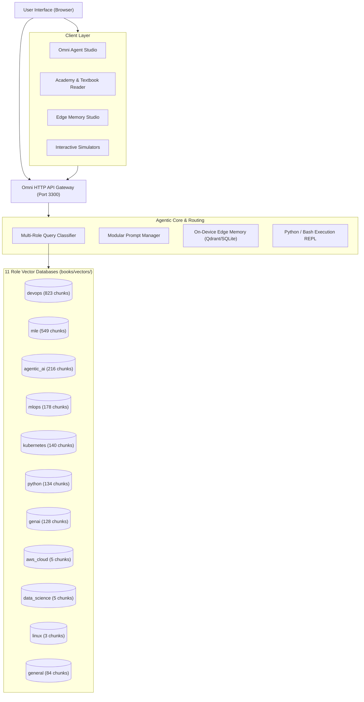

# CL4R1T4S — Omni Agent Studio & AI Observability Platform

**AI Systems Transparency, Multi-Role Agentic RAG & Engineering Academy.**

CL4R1T4S combines deep AI systems observability (extracted system prompts from OpenAI, Google, Anthropic, xAI, Cursor, Devin, Manus, and more) with **Omni Agent Studio** — an enterprise-grade, multi-role Agentic RAG knowledge engine and interactive engineering academy.

---

## ⚡ Quick Start

Launch the entire ecosystem (Agent Studio, Academy Hub, Role Vector DBs, Auto-Ingestion Watchdog) in a single command:

```bash
./start_all.sh
```

| Service | URL | Description |
| :--- | :--- | :--- |
| **Omni Agent Studio** | [http://localhost:3300](http://localhost:3300) | Autonomous Multi-Agent Chat, Edge Memory, Prompt Inspector |
| **Engineering Academy** | [http://localhost:3300/academy/](http://localhost:3300/academy/) | 32+ Live Textbooks, Split-Screen AI Reader, Role Curriculums |
| **RAG Pipeline Manager** | [http://localhost:3300/academy/rag-management.html](http://localhost:3300/academy/rag-management.html) | Multi-Role Database Ingestion & Telemetry |
| **Unified DB Explorer** | [http://localhost:3300/academy/unified-dashboard.html](http://localhost:3300/academy/unified-dashboard.html) | Live SQL Explorer & Multi-Database Inspector |

---

## 🌟 Core System Capabilities

### 1. 🤖 Multi-Role Agentic RAG & Router
- **11 Domain-Isolated Vector Databases**: Dedicated SQLite/FTS5 + Dense Vector catalogs for `devops`, `genai`, `agentic_ai`, `mlops`, `mle`, `kubernetes`, `aws_cloud`, `data_science`, `linux`, `python`, and `general`.
- **Zero Command Syntax Required**: Chatbot automatically classifies user query intent and consults relevant domain databases without requiring tedious `/rag` prefixes.
- **Cross-Database Synthesis**: Queries multiple role stores simultaneously, extracts cited passages with page numbers, and synthesizes answers through role-tailored system prompts.

### 2. 📚 Interactive Engineering Academy & Textbooks
- **32+ Curated Technical Books**: Ingested DevOps commands manuals, ML mathematics, Kubernetes interview guides, Python deep dives, and cloud architecture manuals.
- **Split-Screen AI Reader**: Direct page-by-page textbook browsing with embedded AI tutor for on-the-fly concept explanation and distillation.
- **Role Curriculums & Roadmaps**: Step-by-step tracks for DevOps Specialists, AI Platform Engineers, Cloud Architects, and Data Scientists.

### 3. ⚡ On-Device Edge Memory Studio
- **Sub-50ms Vector Recall**: Qdrant Edge / SQLite hybrid vector store for instant memory retrieval without round-tripping to cloud LLMs.
- **Semantic Teaching & Distillation**: Save terminal outputs, code recipes, and study notes directly to edge memory with confidence-gated injection.

### 4. 💻 Interactive Simulators & SQL Engine
- **Live REPL Execution**: Real-time interactive Python, Bash, and Node.js execution sandbox with stdout/stderr capture and latency metrics.
- **Multi-Database SQL Engine**: Explore vector database tables with transparent aliasing views (`books` and `chunks`).

### 5. 🛡️ System Prompt Observability
- **Extracted Agent Scaffolds**: Full system prompts and tool definitions for major AI systems (Claude 3.7, GPT-4.5/o1/o3, Gemini 2.5, Devin, Manus, Cursor, Windsurf, Perplexity).
- **Dedicated Modular Prompts**: Clean, isolated agent instruction files located in `agent-studio/prompts/agents/`.

---

## 🏗️ Architecture Overview



---

## 🗺️ Future Plan & Strategic Roadmap

```
2026-2027 Strategic Roadmap
├── Phase 1: Advanced Hybrid Search & Re-Ranking (Q4 2026)
├── Phase 2: Multi-Modal Document & Architecture Vision (Q1 2027)
├── Phase 3: Multi-Agent Swarm Orchestration & Code Sandbox (Q2 2027)
├── Phase 4: Enterprise Connectors & Live Sync (Q3 2027)
└── Phase 5: Browser-Native WebGPU & Self-Evaluation (Q4 2027)
```

### 🔹 Phase 1: Advanced Hybrid Search & Re-Ranking
- **Cross-Encoder Re-Ranking**: Integrate BGE-Reranker-Large and ColBERTv2 to boost precision on top-5 multi-role context retrieval.
- **Hierarchical Parent-Child Chunking**: Link granular sentence embeddings to full parent sections for zero-context-loss answer generation.
- **Hypothetical Document Embeddings (HyDE)**: Generate pseudo-answers to align query vectors more closely with technical document passages.

### 🔹 Phase 2: Multi-Modal Document & Architecture Vision
- **Vision RAG (ColPali & LayoutLMv3)**: Ingest and parse architecture diagrams, database schemas, flowcharts, and complex data tables directly from PDF pages.
- **Visual Citations**: Display exact visual bounding boxes on original PDF pages alongside AI synthesized answers.

### 🔹 Phase 3: Multi-Agent Swarm Orchestration & Code Sandboxing
- **LangGraph Consensus Loops**: Implement multi-agent debate (e.g., DevOps Agent proposes Helm chart, Security Specialist reviews permissions, Architect verifies scale).
- **gVisor / Docker Sandboxed Execution**: Upgrade the REPL engine to isolated microVM containers with resource quotas and network policies.
- **Human-in-the-Loop (HITL) Checkpoints**: Structured approval gates before executing infrastructure deployment scripts.

### 🔹 Phase 4: Enterprise Connectors & Live Sync
- **Automated Live Ingestion**: Connectors for GitHub/GitLab repositories, Confluence wikis, Notion workspaces, and Slack channels.
- **Cloud Storage Sync**: Native ingestion pipelines from AWS S3, Google Cloud Storage (GCS), and Azure Blob Storage via change-data-capture (CDC) triggers.
- **Role-Based Access Control (RBAC)**: Fine-grained permissions per role vector database and document sensitivity tier.

### 🔹 Phase 5: Browser-Native WebGPU Acceleration & Continuous Evaluation
- **In-Browser Embeddings**: Run lightweight 384-D / 768-D embedding models directly inside the client browser via WebGPU / ONNX Runtime Web for 0ms network latency.
- **Automated Ragas / TruLens Telemetry**: Continuous evaluation of RAG faithfulness, answer relevance, and context precision with automated regression alerts.

---

## 📖 Documentation Index

- [⚡ QUICK_START.md](./QUICK_START.md) — 30-second rapid setup guide
- [🧭 NAVIGATION_GUIDE.md](./NAVIGATION_GUIDE.md) — Complete walkthrough of Studio & Academy features
- [📚 DATABASE_GUIDE.md](./DATABASE_GUIDE.md) — Multi-role vector database schemas and management
- [🤖 AGENTIC_RAG_GUIDE.md](./AGENTIC_RAG_GUIDE.md) — Agent routing, prompt structures, and multi-role orchestration

---

## 🛠 Contributing & AI Observability

Have newly extracted system prompts, agent scaffolding, or curated technical manuals? Contributions are welcome!
Submit a Pull Request following our prompt template standards in `agent-studio/prompts/agents/`.
